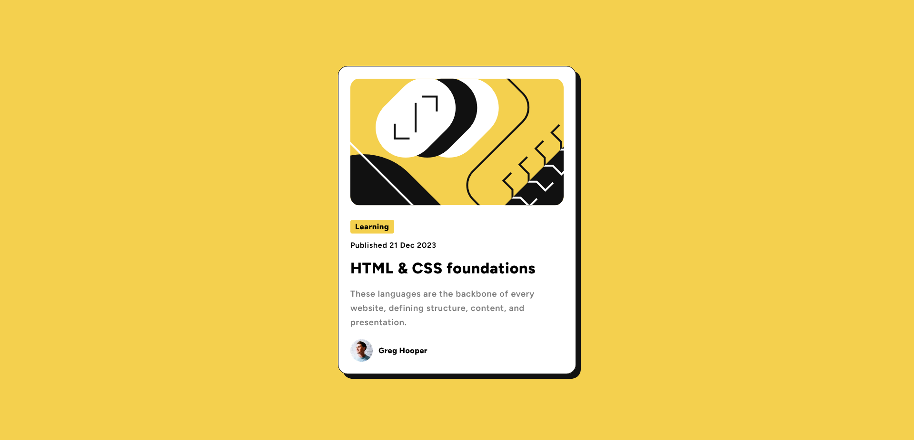

# Frontend Mentor - Blog preview card solution

This is a solution to the [Blog preview card challenge on Frontend Mentor](https://www.frontendmentor.io/challenges/blog-preview-card-ckPaj01IcS). Frontend Mentor challenges help you improve your coding skills by building realistic projects. 

## Table of contents

- [Overview](#overview)
  - [The challenge](#the-challenge)
  - [Screenshot](#screenshot)
  - [Links](#links)
- [My process](#my-process)
  - [Built with](#built-with)
  - [What I learned](#what-i-learned)
  - [Useful resources](#useful-resources)
- [Author](#author)
- [Acknowledgments](#acknowledgments)

## Overview

### The challenge

Users should be able to:

- See hover and focus states for all interactive elements on the page

### Screenshot



### Links

- Solution URL: [Github files](https://github.com/EJMK18/FEM-blog-card)
- Live Site URL: [Add live site URL here](https://your-live-site-url.com)

### Built with

- Semantic HTML5 markup
- CSS custom properties
- Flexbox
- CSS Grid

### What I learned

- I have learnt how to create custom pointer cursors. Cursors are not stylable. Therefore, the url value should be used with the cursor property within the CSS stylesheet. The url value should point to the location of the custom cursor. Image files can be used in this regard.

```css
h1:hover,
h1:active {
	color: var(--primary-colour);
	cursor: url(pointer-black-hand.png), pointer;
}
```

### Useful resources

- https://www.pngwing.com/ 
- Creating custom cursors with CSS (https://blog.logrocket.com/creating-custom-mouse-cursor-css/)

## Author

- Frontend Mentor - [@EJMK18](https://www.frontendmentor.io/profile/EJMK18)
- Twitter - [@ejmk18](https://www.twitter.com/ejmk18)

## Acknowledgments

- https://blog.logrocket.com
- https://www.pngwing.com/